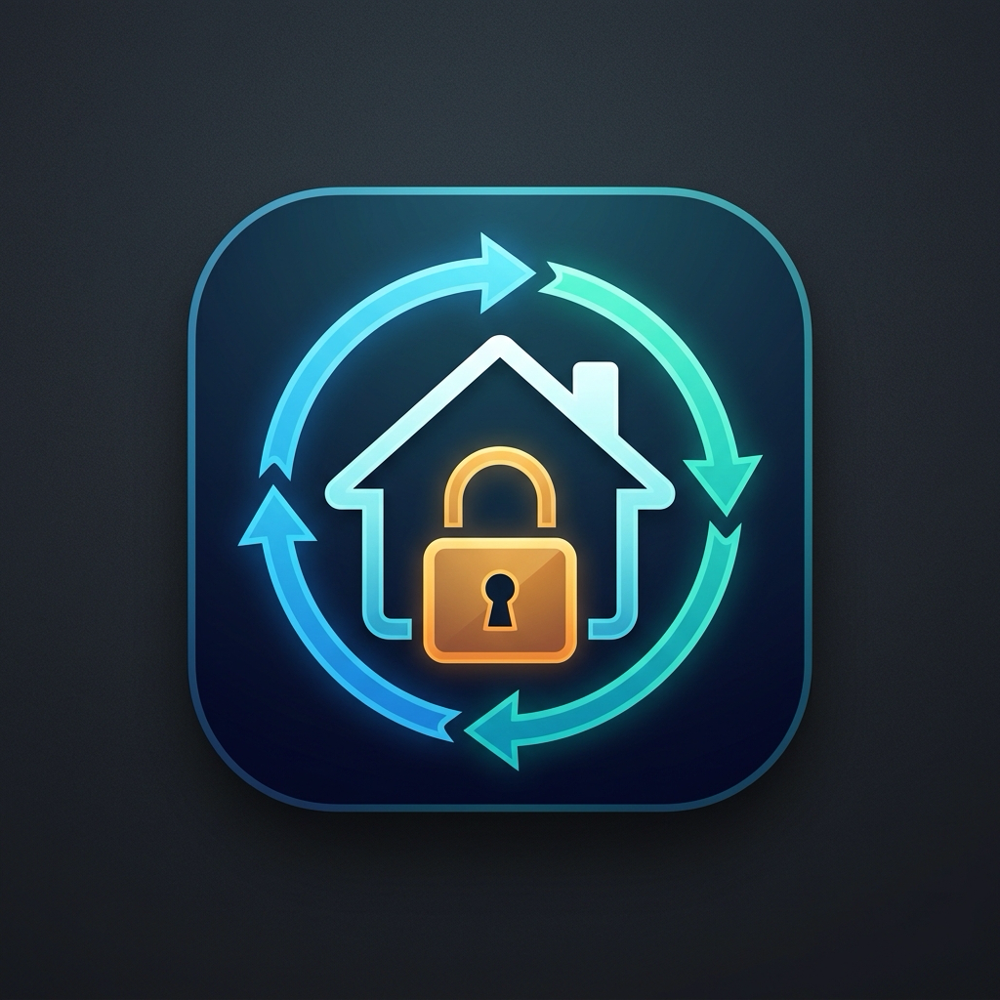

<p align="center">
  
</p>

<h1 align="center">HACS Private Repo Syncer</h1>

<p align="center">
  <strong>安全、自动化地将 GitHub 私有仓库中的自定义组件同步至 Home Assistant</strong>
</p>

<p align="center">
  <a href="https://github.com/hacs/default"></a>
  <a href="https://github.com/xiaoxianbuild/hacs-private-repo-syncer/actions/workflows/release.yml"></a>
  <a href="https://github.com/xiaoxianbuild/hacs-private-repo-syncer/releases"></a>
  <a href="LICENSE"></a>
</p>

---

## ✨ 核心特性

- 🚀 **智能混合项目提取（Hybrid / Monorepo Support）**：
  若您的私有仓库是全栈或混合仓库（例如包含 Go/Node 后端服务、`Dockerfile`、`node_modules`、前端源码等），同步引擎将**只提取** `custom_components/<domain>` 子目录，彻底杜绝垃圾文件污染 Home Assistant。
- 📦 **原生 Update Entity 支持**：
  为每个受监控的私有仓库自动创建 Home Assistant 原生的 `Update` 实体。在 HA 的“设置 -> 系统 -> 更新”面板中直观查看版本变动、Release Notes，并支持一键点击安装更新。
- 🔒 **全异步 & 零环境依赖**：
  无需在 HA OS / 容器中安装 `git` 或配置复杂的 SSH 密钥。直接基于 `aiohttp` 异步流式下载 GitHub API zip 归档，性能极高且无阻塞。
- 🛡️ **生产级安全防护**：
  - 内置 **Zip Slip 路径穿越漏洞防御**；
  - 更新时自动备份旧版本并在解压异常时**原子回滚**，保障系统稳定性。
- ⚙️ **完整的 UI 配置流程**：
  支持通过 Home Assistant 原生 Config Flow 与 Options Flow 随时添加、修改、移除私有仓库及轮询周期，无需手写 YAML。
- 🔔 **更新完成智能通知**：
  插件更新完成后自动发送 HA 持久化通知（Persistent Notification），提示用户重启 Home Assistant 生效。

---

## 📁 支持的私有仓库目录结构

本同步器能够智能识别以下各类仓库结构：

### 结构 1：混合/全栈 Monorepo 项目（推荐）
```text
my-private-project/
├── API_EN.md
├── docker-compose.yml
├── Dockerfile
├── go.mod
├── main.go
├── node_modules/             <-- 自动被忽略
├── package.json
├── custom_components/        <-- 仅提取此目录
│   └── bandwagon_usage/
│       ├── manifest.json
│       ├── __init__.py
│       └── sensor.py
└── README.md
```

### 结构 2：标准 HACS 仓库
```text
my-hacs-component/
├── hacs.json
├── README.md
└── custom_components/
    └── my_service/
        ├── manifest.json
        └── ...
```

### 结构 3：扁平根目录结构
```text
my-flat-component/
├── manifest.json             <-- 包含 "domain": "my_service"
├── __init__.py
└── ...
```

---

## 🔑 GitHub 访问令牌准备 (PAT)

由于是访问私有仓库，需要生成一个 GitHub Personal Access Token：

1. 登录 GitHub，访问 **Settings** -> **Developer settings** -> **Personal access tokens**；
2. 推荐选择 **Fine-grained tokens** 或 **Tokens (classic)**：
   - **Fine-grained token**：选择对应的私有仓库，在 **Repository permissions** 中设置 **Contents: Read-only** 即可；
   - **Classic token**：勾选 `repo` 作用域。
3. 复制生成的 Token 备用。

---

## 📥 安装方法

### 方式一：通过 HACS 自定义存储库添加（推荐）

1. 打开 Home Assistant 前端的 **HACS**；
2. 点击右上角的三个点，选择 **自定义存储库 (Custom repositories)**；
3. 输入存储库 URL：`xiaoxianbuild/hacs-private-repo-syncer`，类别选择 **集成 (Integration)**；
4. 点击添加后，搜索并下载 **HACS Private Repo Syncer**；
5. 重启 Home Assistant。

### 方式二：手动安装

将本仓库的 `custom_components/private_repo_syncer` 文件夹复制到 Home Assistant 的 `/config/custom_components/` 目录下，并重启 Home Assistant。

---

## 🛠️ 配置使用指南

1. 进入 Home Assistant **设置 (Settings)** -> **设备与服务 (Devices & Services)**；
2. 点击右下角 **添加集成 (Add Integration)**，搜索 `HACS Private Repo Syncer`；
3. **第一步**：粘贴您的 GitHub Personal Access Token；
4. **第二步**：输入您需要同步的私有仓库，格式如：
   ```text
   your_username/repo_a
   your_username/repo_b@dev
   ```
   - 支持多行或逗号分隔；
   - 支持使用 `@分支名` 指定跟踪特定分支（若不指定，优先检测最新 Release，无 Release 时跟踪默认分支）。
5. 点击提交即可！

---

## 🎛️ 服务与自动化调用 (Services)

集成注册了以下服务，方便您在自动化或脚本中调用：

### 1. `private_repo_syncer.sync`
手动触发下载并更新指定或全部私有仓库：
```yaml
service: private_repo_syncer.sync
data:
  repository: "your_username/my-private-component" # 可选，不填则同步全部配置的仓库
  force: false                                      # 可选，是否强制覆盖
```

### 2. `private_repo_syncer.check_updates`
立即向 GitHub 查询是否有新 Release 或新提交：
```yaml
service: private_repo_syncer.check_updates
```

---

## 🚀 自动化发布与 Tag 规则 (GitHub Actions)

仓库内置了自动 Release 工作流（`.github/workflows/release.yml`）：
- **触发规则**：推送符合语义化版本规则的 Git Tag，例如 `v1.0.0`, `v0.2.1-beta.1` 等（正则匹配 `v[0-9]+.[0-9]+.[0-9]+*`）。
- **执行流程**：
  1. 自动执行 Python 单元测试，确保代码质量；
  2. 自动打包生成符合 HACS 规范的发布资产 `private_repo_syncer.zip`；
  3. 自动生成 GitHub Release、更新日志并关联 Release Asset。

发布新版本只需执行：
```bash
git tag v1.0.0
git push origin v1.0.0
```

---

## 🧪 单元测试

本项目核心解压引擎包含严格的自动化测试：
```bash
python3 -m unittest discover -s tests -p "test_*.py"
```

---

## 📄 License

MIT License
